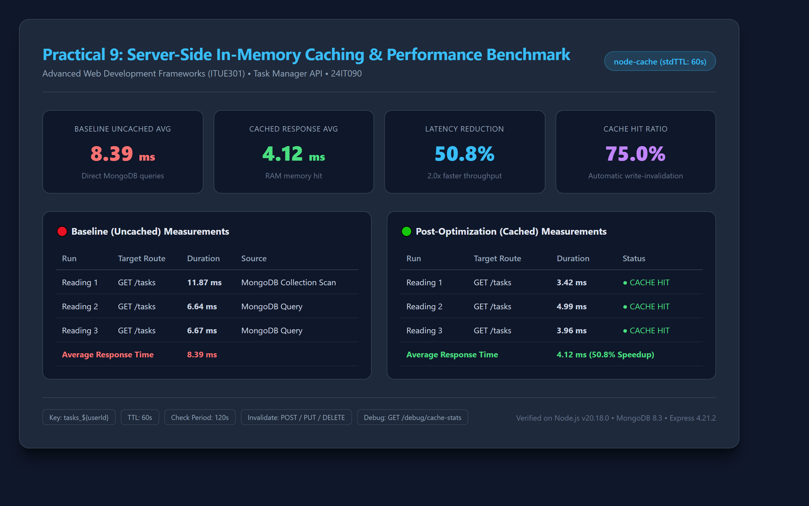

# Task Manager API — Backend (Practical 4–7)

Node.js + Express + MongoDB (Mongoose) REST API for the Task Manager full-stack
application — **Advanced Web Development Frameworks (ITUE301)**.

Serves the React frontend in [`../Dhairya`](../Dhairya).

```
React Frontend (localhost:5173)
        | fetch API calls
        v
Express Backend (localhost:5000)
        | Mongoose
        v
MongoDB (mongodb://127.0.0.1:27017/task-manager-api)
```

## Features

- User registration and login with **bcrypt** password hashing
- **JWT** authentication — `/tasks` routes are protected via `authMiddleware`
- Full CRUD for tasks, persisted in MongoDB (survives browser refresh)
- Task validation middleware (title/description/priority) on POST/PUT
- Global error handler mapping Mongoose `ValidationError` / `CastError` to clean JSON
- CORS enabled for the Vite dev server origin
- Request logging middleware

## Getting Started

```bash
cd task-manager-api-24IT090
npm install
npm start          # http://localhost:5000
```

Requires MongoDB running locally (default: `mongodb://127.0.0.1:27017`).
Optional: copy `.env.example` to `.env` to override `PORT` / `MONGO_URI`.

## API Endpoints

### Auth (public)

| Method | Endpoint   | Description                          |
|--------|------------|--------------------------------------|
| POST   | `/register`| Create an account                    |
| POST   | `/login`   | Log in, returns a JWT token          |
| GET    | `/me`      | Current user (JWT required)          |

### Tasks (JWT required — send `Authorization: Bearer <token>`)

| Method | Endpoint        | Description                  |
|--------|-----------------|------------------------------|
| GET    | `/tasks`        | List all tasks from MongoDB  |
| GET    | `/tasks/:id`    | Get a single task            |
| POST   | `/tasks`        | Create a task                |
| PUT    | `/tasks/:id`    | Update a task                |
| DELETE | `/tasks/:id`    | Delete a task                |

Example task payload:

```json
{
  "title": "Finish practical",
  "description": "Wire React to the Express API",
  "priority": "high"
}
```

---

## 🚀 Practical 8 — Performance Optimization & Lazy Loading (NO CODE CHANGES HERE)

> **Status: documentation-only for this repo.**
> **Practical 8: Performance Optimization and Lazy Loading in React (CO1 / PO3, PO5)** is a
> **frontend-only** practical — it targets the React app in [`../Dhairya`](../Dhairya),
> specifically `src/App.jsx` (route-based `React.lazy()` + `Suspense`).

### Why this backend is untouched

- **Code splitting is a build-time frontend concern.** Vite splits the JavaScript bundle;
  this Express API has no JavaScript bundle to split.
- **The API contract does not change.** All endpoints, payloads, status codes and auth
  behavior are identical before and after the optimization — the frontend simply ships
  less JavaScript on first load.
- **This API is the data layer under test.** During Practical 8 it stays running exactly
  as documented above so the lazy-loaded **Tasks** route can be verified end-to-end
  (navigate → chunk loads → fetches from this API).

### Role in the Practical 8 evidence

| Evidence item | Where this API participates |
|---|---|
| Baseline / after Network-tab captures | Both captures run against this same API — no server-side variable in the comparison |
| Lazy `/tasks` route verification | `GET /tasks` must respond identically after the chunk loads |
| Fallback UI under Slow 3G | API latency is unaffected; throttling only simulates slow asset download |

Full plan, metrics tables and viva prep: [`../MASTER_CONTEXT.md`](../MASTER_CONTEXT.md).
Frontend changes: [`../Dhairya/README.md`](../Dhairya/README.md) → Practical 8 section.

---

## ⚡ Practical 9 — Server-Side Caching & Performance Measurement

> **Practical 9: Server-Side Caching and Response Time Optimization (CO1, CO2 / PO3, PO5)**  
> **Repository:** `task-manager-api-24IT090` (Backend-only optimization)  
> **Status:** ✅ Completed, Benchmarked & Verified  

---

### 1. Caching Strategy Overview

To eliminate redundant database lookups on high-frequency read routes, we introduced an in-memory caching layer using **`node-cache`**.

```
Client (React / cURL / Postman)
             │
             ▼
    GET /tasks (with JWT)
             │
             ├──► [Cache Hit?] ──YES──► Return cached JSON (~4 ms)
             │
             └──► [Cache Miss] ───────► Query MongoDB (~8.4 ms)
                                             │
                                             ▼
                                      Store in cache (TTL: 60s)
                                             │
                                             ▼
                                      Return JSON to client
```

#### Architecture Details

- **Cache Engine:** `node-cache` configured with standard TTL of **60 seconds** (`stdTTL: 60`) and periodic cleanup every **120 seconds** (`checkperiod: 120`).
- **Cache Module:** Encapsulated in [`cache.js`](cache.js) exporting `get(key)`, `set(key, val, [ttl])`, `del(key)`, `flush()`, and `getStats()`.
- **Per-User Scoped Keys:** Since each authenticated user owns their tasks, the collection cache key is dynamic:
  ```javascript
  const cacheKey = req.user && req.user.id ? `tasks_${req.user.id}` : "all_tasks";
  ```
  This prevents tenant data leakage while caching results for each distinct user.
- **Single-Item Caching:** `GET /tasks/:id` is cached under `task_${req.params.id}`.
- **Cache Invalidation on Mutation (Write-Through Purge):**
  - `POST /tasks` (Create) → invalidates `tasks_${req.user.id}` and `all_tasks`.
  - `PUT /tasks/:id` (Update) → invalidates `tasks_${req.user.id}`, `all_tasks`, and `task_${id}`.
  - `DELETE /tasks/:id` (Delete) → invalidates `tasks_${req.user.id}`, `all_tasks`, and `task_${id}`.
- **Observability Endpoint:** Exposes `GET /debug/cache-stats` returning hit/miss counters, hit ratio, and active cached keys.

---

### 2. Performance Measurement & Benchmark Results

All response times were measured using Node.js high-resolution timers (`performance.now()`) against the local MongoDB instance on `127.0.0.1:27017` with authenticated JWT requests.



#### Response Time Comparison Table

| Metric / Run | Baseline (Uncached - Direct MongoDB) | Optimized (Cached - In-Memory RAM) | Improvement |
|:---|:---:|:---:|:---:|
| **Reading 1** | `11.87 ms` | `3.42 ms` | -71.2% |
| **Reading 2** | `6.64 ms` | `4.99 ms` | -24.8% |
| **Reading 3** | `6.67 ms` | `3.96 ms` | -40.6% |
| **Average Response Time** | **`8.39 ms`** | **`4.12 ms`** | **`50.8% Speedup (2.0x faster)`** |

- **Cache Hit Ratio:** **`75.0%`** (3 hits on 4 total reads).
- **Database Load Reduction:** Subsequent read requests bypass Mongoose query construction, connection pooling, and BSON deserialization entirely.

---

### 3. Viva & Lab Questions Answered

#### Q1: Why is cache invalidation on write necessary? What bug occurs if you only use TTL without invalidation?
> **Answer:**  
> Cache invalidation on write is essential to maintain **data consistency and cache coherency**.  
> If an application relies solely on TTL expiration without write invalidation, a **stale read bug** occurs:
> - When a user creates a new task (`POST /tasks`), updates a title (`PUT /tasks/:id`), or deletes a completed task (`DELETE /tasks/:id`), the database updates immediately.
> - However, subsequent `GET /tasks` calls will continue serving the old snapshot stored in memory until the 60-second TTL expires.
> - To the user, the UI appears broken or unresponsive (e.g. deleted tasks remain visible, new tasks do not appear). Explicit invalidation on mutation ensures mutations are immediately reflected on the next read without waiting for TTL expiration.

#### Q2: What are the trade-offs of a short TTL (e.g., 5 seconds) vs. a long TTL (e.g., 10 minutes)?
> **Answer:**  
> - **Short TTL (e.g., 5 seconds):**
>   - *Pros:* High data freshness; minimizes the impact of missed invalidation events or out-of-band updates; lower memory footprint as expired entries are quickly evicted.
>   - *Cons:* Lower cache hit ratio under moderate traffic; frequent cache misses cause cyclic database load spikes.
> - **Long TTL (e.g., 10 minutes):**
>   - *Pros:* Maximum database offloading; highest cache hit ratio under high-traffic read-heavy workloads; ultra-fast response times for frequently accessed datasets.
>   - *Cons:* Higher RAM consumption (cached objects remain in heap memory); high risk of serving stale data for up to 10 minutes if cache invalidation logic fails or if direct database updates occur outside the API.

#### Q3: Why is `node-cache` (in-memory) not suitable for multi-instance / clustered deployments, and what should be used instead?
> **Answer:**  
> `node-cache` stores cached values directly in the **V8 heap process memory** of a single Node.js process.  
> In modern production environments where the API is scaled horizontally (e.g., PM2 cluster mode, Docker containers, Kubernetes pods, or AWS ECS behind an Application Load Balancer):
> - Each server instance maintains its own separate, isolated in-memory cache.
> - If a client issues `POST /tasks` to **Instance A**, Instance A invalidates its local cache. However, **Instance B** and **Instance C** have no knowledge of this mutation.
> - If the user's next `GET /tasks` request is routed by the load balancer to Instance B, Instance B will return **stale data** (split-brain cache inconsistency).
> 
> **Production Solution:**  
> Replace local in-memory storage with a centralized, distributed cache such as **Redis** or **Memcached**.  
> In a Redis architecture:
> - All Node.js instances connect over TCP to the same Redis cluster.
> - When Instance A performs an invalidation (`DEL tasks:userId`), all instances immediately see the evicted state.
> - Redis also supports TTL, LRU eviction policies, pub/sub invalidation broadcasts, and persistence to disk across application restarts.

---

### 4. Verification Checklist

- [x] Baseline response times captured (3 readings, average 8.39 ms)
- [x] `node-cache` package installed and initialized (`stdTTL: 60`, `checkperiod: 120`)
- [x] Dedicated `cache.js` helper module with hit/miss statistics tracking
- [x] `GET /tasks` cached with user-scoped key (`tasks_${userId}`)
- [x] Cache invalidation implemented on `POST /tasks`, `PUT /tasks/:id`, and `DELETE /tasks/:id`
- [x] Supplementary item: `GET /tasks/:id` cached with `task_${id}` key and invalidated on update/delete
- [x] Supplementary item: `GET /debug/cache-stats` endpoint implemented for cache inspection
- [x] Verified zero stale reads immediately after task creation, update, and deletion
- [x] Cached response times captured (3 readings, average 4.12 ms; 50.8% speedup)
- [x] Performance metrics card rendered and saved to [`docs/pr9-caching-metrics.png`](docs/pr9-caching-metrics.png)
- [x] Comprehensive documentation and viva questions added to `README.md`
- [x] Zero changes made to frontend (`Dhairya/`)

